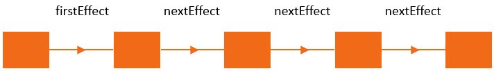
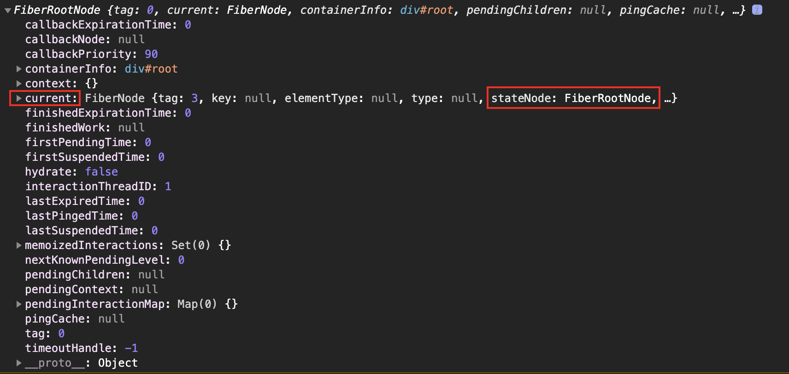
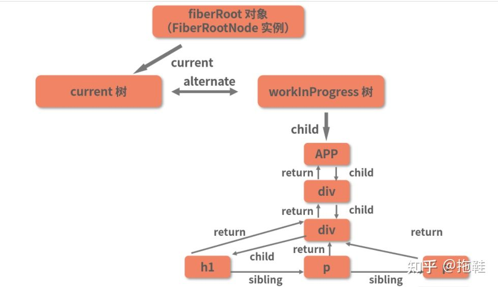
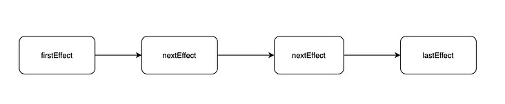

# React 原理
[React基础知识](https://github.com/shunjizhan/mini-react#react-%E7%9F%A5%E8%AF%86%E7%82%B9)
[Mini React的实现](https://github.com/shunjizhan/mini-react#react-%E7%9F%A5%E8%AF%86%E7%82%B9)

# Fiber
## 动机
### 问题
React 16 之前的版本比对更新 VirtualDOM 的过程是采用循环加递归实现的，这种比对方式有一个问题，就是一旦任务开始进行就无法中断，如果应用中组件数量庞大，主线程被长期占用，直到整棵 VirtualDOM 树比对更新完成之后主线程才能被释放，主线程才能执行其他任务。这就会导致一些用户交互，动画等任务无法立即得到执行，页面就会产生卡顿, 非常的影响用户体验。 

**核心问题**：递归无法中断，执行重任务耗时长。 JavaScript 又是单线程，无法同时执行其他任务，导致任务延迟页面卡顿，用户体验差。

### 解决方案
所谓的**Time Slicing 时间分片**：
1. 利用浏览器空闲时间执行任务，拒绝长时间占用主线程
2. 放弃递归只采用循环，因为循环可以被中断
3. 任务拆分，将任务拆分成一个个的小任务

### 实现思路
为了实现任务的终止再继续，DOM比对算法被分成了两部分：
1. 构建 Fiber    (可中断)
2. 提交 Commit   (不可中断)

DOM 初始渲染: virtualDOM -> Fiber -> Fiber[] -> DOM
DOM 更新操作: newFiber vs oldFiber -> Fiber[] -> DOM

## requestIdleCallback
任务可中断的实现，就需要用到requestIdleCallback:利用浏览器的空余时间执行任务，如果有更高优先级的任务要执行时，当前执行的任务可以被终止，优先执行高级别任务。

页面是一帧一帧绘制出来的，当每秒绘制的帧数达到 60 时，页面是流畅的，小于这个值时， 用户会感觉到卡顿。每一帧分到的时间是 1000/60 ≈ 16 ms，如果每一帧执行的时间小于16ms，就说明浏览器有空余时间

如果任务在剩余的时间内没有完成则会停止任务执行，继续优先执行主任务，也就是说requestIdleCallback 总是利用浏览器的空余时间执行任务

```javascript
requestIdleCallback(function(deadline) {
  deadline.timeRemaining() // 获取浏览器的空余时间
})
```

### 例子
页面中有两个按钮和一个DIV，点击第一个按钮执行一项昂贵的计算，使其长期占用主线程，当计算任务执行的时候去点击第二个按钮更改页面中 DIV 的背景颜色。

```html
<div class="playground" id="play">playground</div>
<button id="work">start work</button>
<button id="interaction">handle some user interaction</button>
```

```ts
var play = document.getElementById("play")
var workBtn = document.getElementById("work")
var interactionBtn = document.getElementById("interaction")
var iterationCount = 100000000
var value = 0

var expensiveCalculation = function (IdleDeadline) {
  while (iterationCount > 0 && IdleDeadline.timeRemaining() > 1) {
    value =
      Math.random() < 0.5 ? value + Math.random() : value + Math.random()
    iterationCount = iterationCount - 1
  }
  requestIdleCallback(expensiveCalculation)
}

workBtn.addEventListener("click", function () {
  requestIdleCallback(expensiveCalculation)
})

interactionBtn.addEventListener("click", function () {
  // 虽然在执行expensiveCalculation，但这个click是完全不会卡顿，瞬间变色
  play.style.background = "palegreen"
})
```

实际上，requestIdleCallback的原生API还有一些问题：
- 浏览器兼容性；
- 触发频率不稳定，受很多因素影响。比如当我们的浏览器切换tab后，之前tab注册的requestIdleCallback触发的频率会变得很低。

所以在React中实现了功能更完备的`requestIdleCallbackpolyfill`，这就是Scheduler。除了在空闲时触发回调的功能外，Scheduler还提供了多种调度优先级供任务设置。

## Fiber的实现
### React 架构
React 16 版本的架构可以分为三层：调度层、协调层、渲染层。

- **Scheduler (调度层)**：调度任务的优先级，高优任务优先进入协调器
- **Reconciler (协调层)**：构建 Fiber 数据结构，比对 Fiber 对象找出差异, 记录 Fiber 对象要进行的 DOM 操作
- **Renderer (渲染层)**：负责将发生变化的部分渲染到页面上

**Scheduler 调度层**
requestIdleCallback API自身也存在一些问题，比如说并不是所有的浏览器都支持它，而且它的触发频率也不是很稳定，所以 React 最终放弃了 requestIdleCallback 的使用。

在 React 中，官方实现了自己的任务调度库，这个库就叫做 Scheduler。它也可以实现在浏览器空闲时执行任务，而且还可以设置任务的优先级，高优先级任务先执行，低优先级任务后执行。

**Reconciler 协调层**
在 React 15 的版本中，协调器和渲染器交替执行，即找到了差异就直接更新差异。在 React 16 的版本中，这种情况发生了变化，协调器和渲染器不再交替执行。协调器负责找出差异，在所有差异找出之后，统一交给渲染器进行 DOM 的更新。也就是说协调器的主要任务就是找出差异部分，并为差异打上标记。

**Renderer 渲染层**
渲染器根据协调器为 Fiber 节点打的标记，同步执行对应的DOM操作。

在整个过程中，调度器和协调器的工作是在内存中完成的是可以被打断的，渲染器的工作被设定成不可以被打断，所以不存在DOM 渲染不完全的问题。

### Fiber数据结构
```tsx
type Fiber = {
  /* --------------- DOM 实例相关 --------------- */
  tag: WorkTag,     // 节点类型: 元素, 文本, 组件
  type: any,        // 组件类型: div、span、组件构造函数
  stateNode: any,   // 实例对象, 类组件的实例、原生 dom 实例, 而function组件没有实例, 因此该属性是空
 
	/* --------------- 构建 Fiber 树相关  --------------- */
  return: Fiber | null,   // 指向自己的父级 Fiber 对象
  child: Fiber | null,    // 指向自己的第一个子级 Fiber 对象
  sibling: Fiber | null,  // 指向自己的下一个兄弟 iber 对象
  
  // 在 Fiber 树更新的过程中，每个 Fiber 都会有一个跟其对应的 Fiber
  // 我们称他为 current <==> workInProgress
  // 在渲染完成之后他们会交换位置
  // alternate 指向当前 Fiber 在 workInProgress 树中的对应 Fiber
	alternate: Fiber | null,
		
  /* --------------- 状态数据相关  **--------------- */
  pendingProps: any,    // 即将更新的 props
  memoizedProps: any,   // 旧的 props
  memoizedState: any,   // 旧的 state
		
  /* --------------- 副作用相关 --------------- */
  updateQueue: UpdateQueue<any> | null,   // 该 Fiber 对应的组件产生的状态更新会存放在这个队列里面 
  effectTag: SideEffectTag,         // 用来记录当前 Fiber 要执行的 DOM 操作
  firstEffect: Fiber | null,        // 存储第一个要执行副作用的子级 Fiber 对象
  
  // 存储下一个要执行副作用的子级 Fiber 对象
  // 执行 DOM 渲染时要先通过 first 找到第一个, 然后通过 next 一直向后查找
  nextEffect: Fiber | null,
  lastEffect: Fiber | null,         // 存储 DOM 操作完后的副作用 比如调用生命周期函数或者钩子函数的调用
  expirationTime: ExpirationTime,   // 任务的过期时间
  mode: TypeOfMode,                 // 当前组件及子组件处于何种渲染模式
};
```



### 双缓存技术
**缓存可以理解为Fiber树是对DOM的缓存。** React 使用双缓存技术(两棵Fiber树）完成 Fiber 树的构建与替换，实现DOM对象的快速更新。

在 React 中最多会同时存在两棵 Fiber 树，当前在屏幕中显示的内容对应的 Fiber 树叫做 current Fiber 树，当发生更新时，React 会在内存中重新构建一颗新的 Fiber 树，这颗正在构建的 Fiber 树叫做 workInProgress Fiber 树。在双缓存技术中，workInProgress Fiber 树就是即将要显示在页面中的 Fiber 树，当这颗 Fiber 树构建完成后，React 会使用它直接替换 current Fiber 树达到快速更新 DOM 的目的，因为 workInProgress Fiber 树是在内存中构建的所以构建它的速度是非常快的。

一旦 workInProgress Fiber 树在屏幕上呈现，它就会变成 current Fiber 树。

在 current Fiber 节点对象中有一个 alternate 属性指向对应的 workInProgress Fiber 节点对象，在 workInProgress Fiber 节点中有一个 alternate 属性也指向对应的 current Fiber 节点对象。


### 区分 fiberRoot 与 rootFiber
- fiberRoot 表示 Fiber 数据结构对象，是 Fiber 数据结构中的最外层对象（它不是一个Fiber对象）
- rootFiber 表示组件挂载点对应的 Fiber 对象（它是一个Fiber对象），比如 React 应用中默认的组件挂载点就是 id 为 root 的 div
- fiberRoot 包含 rootFiber，在 fiberRoot 对象中有一个 current 属性，存储 rootFiber
- rootFiber 指向 fiberRoot，在 rootFiber 对象中有一个 stateNode 属性，指向 fiberRoot
- 在 React 应用中 fiberRoot 只有一个，而 rootFiber 可以有多个，因为 render 方法是可以调用多次的
- fiberRoot 会记录应用的更新信息，比如协调器在完成工作后，会将工作成果存储在 fiberRoot 中。



### 具体渲染流程
要将 React 元素渲染到页面中，分为两个阶段，render 阶段和 commit 阶段。
- render 阶段负责创建 Fiber 数据结构并为 Fiber 节点打标记，标记当前 Fiber 节点要进行的 DOM 操作。
  - 创建rootFiber和fiberRoot
  - 构建workInProgress Fiber树 （workLoopSync）
    - 从根节点开始，从父到子构建一条Fiber链
    - 从子到父，一层一层根据sibling构建剩余的fiber，每一层子节点都会把effects链表加到父节点的链表中，最后root就会有一个完整的effects链表
- commit 阶段负责根据 Fiber 节点标记 ( effectTag ) 进行相应的 DOM 操作。

### 1. render阶段
#### 1.1 渲染入口
```ts
// packages/react-dom/src/client/ReactDOMLegacy.js
/**
 * element 要进行渲染的 ReactElement, createElement 方法的返回值
 * container 渲染容器 <div id="root"></div>
 * callback 渲染完成后执行的回调函数
 */
export function render(
  element: React$Element<any>,
  container: Container,
  callback: ?Function,
) {
  return legacyRenderSubtreeIntoContainer(
    null,       // 父组件 初始渲染没有父组件 传递 null 占位
    element,
    container,
    false,      // 是否为服务器端渲染 false 不是服务器端渲染 true 是服务器端渲染
    callback,
  );
}
```
接下来比较核心的是创建rootFiber和fiberRoot
```ts
/**
 * 将子树渲染到容器中
 * parentComponent: 父组件, 初始渲染传入了 null
 * children: render 方法中的第一个参数, 要渲染的 ReactElement
 * container: 渲染容器
 * forceHydrate: true 为服务端渲染, false 为客户端渲染
 * callback: 组件渲染完成后需要执行的回调函数
 **/
function legacyRenderSubtreeIntoContainer(
  parentComponent: ?React$Component<any, any>,
  children: ReactNodeList,
  container: Container,
  forceHydrate: boolean,
  callback: ?Function,
) {
  /**
   * 检测 container 是否已经是初始化过的渲染容器
   * react 在初始渲染时会为最外层容器添加 _reactRootContainer 属性
   * react 会根据此属性进行不同的渲染方式
   * root 不存在 表示初始渲染
   * root 存在 表示更新
   */
  let root: RootType = (container._reactRootContainer: any);
  let fiberRoot;
  if (!root) {
    // 初始渲染
    // 初始化 Fiber 数据结构: 创建 fiberRoot 及 rootFiber
    // 为 container 容器添加 _reactRootContainer 属性
    root = container._reactRootContainer = legacyCreateRootFromDOMContainer(
      container,
      forceHydrate,
    );                  // rootFiber
    fiberRoot = root._internalRoot;   // fiberRoot

    // 处理callback
    // ...

    // 初始化渲染不执行批量更新,因为批量更新是异步的是可以被打断的, 但是初始化渲染应该尽快完成不能被打断
    unbatchedUpdates(() => {
      updateContainer(children, fiberRoot, parentComponent, callback);
    });
  } else {
    // 非初始化渲染 即更新
    fiberRoot = root._internalRoot;

    // 处理callback
    // ...

    updateContainer(children, fiberRoot, parentComponent, callback);
  }

  // 返回 render 方法第一个参数的真实 DOM 对象作为 render 方法的返回值
  // 就是说渲染谁 返回谁的真实 DOM 对象(这个好像没啥用)
  return getPublicRootInstance(fiberRoot);
}
```

#### 1.2 updateContainer
不管是初次渲染还是更新，都会调用到`updateContainer`来触发任务。

```tsx
// 计算任务的过期时间，再根据任务过期时间创建 Update 任务
export function updateContainer(
  element: ReactNodeList,   // 要渲染的 ReactElement
  container: OpaqueRoot,    // FiberRoot 对象
  parentComponent: ?React$Component<any, any>,    // 父组件 初始渲染为 null
  callback: ?Function,      // 渲染完成执行的回调函数
): ExpirationTime {  
  const current = container.current;    // 从fiberRoot 获取 rootFiber
  
  const currentTime = requestCurrentTimeForUpdate();        // 获取当前距离 react 应用初始化的时间 
  const suspenseConfig = requestCurrentSuspenseConfig();    // 异步加载设置

  // 计算过期时间
  // 为防止任务因为优先级的原因一直被打断而未能执行
  // react 会设置一个过期时间, 当时间到了过期时间的时候
  // 如果任务还未执行的话, react 将会强制执行该任务
  // 初始化渲染时, 任务同步执行不涉及被打断的问题
  const expirationTime = computeExpirationForFiber(
    currentTime,
    current,
    suspenseConfig,
  );

  // 设置FiberRoot.context, 首次执行返回一个emptyContext, 是一个 {}
  const context = getContextForSubtree(parentComponent);
  if (container.context === null) {
    // 初始渲染时将 context 属性值设置为 {}
    container.context = context;
  } else {
    container.pendingContext = context;
  }

  const update = createUpdate(expirationTime, suspenseConfig);  // 创建一个待执行任务  
  update.payload = { element };                                 // 将要更新的组件存储在 payload 对象中, 方便后期获取
  
  // 处理callback
  // ...

  // 将 update 对象加入到当前 Fiber 的更新队列当中 (updateQueue)
  // 大概的结构就是:
  // update.next = nextUpdate
  // current.updateQueue = update
  enqueueUpdate(current, update);     
        
  scheduleWork(current, expirationTime);    // 调度和更新 current 对象
  return expirationTime;                    // 返回过期时间
}
```

#### 1.3 performSyncWorkOnRoot
`scheduleWork`会调用`performSyncWorkOnRoot`
```ts
// 进入 render 阶段, 构建 workInProgress Fiber 树
function performSyncWorkOnRoot(root) {
  const lastExpiredTime = root.lastExpiredTime;
  const expirationTime = lastExpiredTime !== NoWork ? lastExpiredTime : Sync;

  // workInProgressRoot 为全局变量 默认值为 null, 初始渲染时值为 null
  // 如果 root 和 workInProgressRoot 不相等,说明还没有构建 workInProgress Fiber 树
  // 那就构建 workInProgressFiber 树及rootFiber
  if (root !== workInProgressRoot || expirationTime !== renderExpirationTime) {
    // 为 FiberRoot（root）对象添加 finishedWork属性，表示 render 阶段执行完成后构建的待提交的 Fiber 对象
    // workInProgress还会创建workInProgress，代表rootFiber
    prepareFreshStack(root, expirationTime);
  }

  if (workInProgress !== null) {
    do {
      workLoopSync();
    } while (true);
    
    // 将构建好的新 Fiber 对象存储在 finishedWork 属性中，提交阶段使用
    root.finishedWork = (root.current.alternate: any);
    root.finishedExpirationTime = expirationTime;

    // 结束 render 阶段，进入 commit 阶段
    finishSyncRender(root);
  }
}
```

#### 1.4 workLoopSync
```ts
function workLoopSync() {
  // workInProgress 是一个全局 fiber 对象,它的值不为 null 意味着该 fiber 对象上仍然有更新要执行
  // performUnitOfWork 会构建当前workinprogress fiber的children，返回第一个child，第一个child指向它的sibing，指向它的sibling……
  // 所以while就会一直创建所有的fiber，并且可以打断
  while (workInProgress !== null) {
    workInProgress = performUnitOfWork(workInProgress);
  }
}
```

#### 1.5 performUnitOfWork
```tsx
function performUnitOfWork(unitOfWork: Fiber): Fiber | null {
  // unitOfWork：workInProgress Fiber 树中的 rootFiber
  // current：currentFiber 树中的 rootFiber
  const current = unitOfWork.alternate;


  // 从父到子, 构建 Fiber 节点对象。返回值 next 为当前节点的子节点
  // 结束以后就是构建了一串子节点
  const next = beginWork(current, unitOfWork, renderExpirationTime);
 
  if (next === null) {    // 子节点不存在，说明当前节点向下遍历子节点已经到底了
    // 从子到父（beginWork产生的那一串子节点）, 通过sibling构建其余节点 Fiber 对象
    // 继续向上返回 遇到兄弟节点 构建兄弟节点的子 Fiber 对象 直到返回到根 Fiber 对象
    // 创建每一个节点的真实 DOM 对象并将其添加到 stateNode 属性中
    // 构建 effect 链表结构,把每个child的effects添加到parentNode的effects中，最终root的effects就会包含所有的effects
    next = completeUnitOfWork(unitOfWork);
  }
  return next;
}

/*  performUnitOfWork 第一次执行的过程：（可打断）
  第一级：      Root (WIP)
  第二级：    C1 (返回这个，并且设置成next WIP) C2 C3 ...
  第三级：  X1 X2 X3 ...
*/

/*  performUnitOfWork 第二次执行的过程：可打断）
  第一级：      Root 
  第二级：    C1 (WIP) C2 C3 ...
  第三级：  X1 (返回这个，并且设置成next WIP) X2 X3 ...
*/

/*  completeUnitOfWork 执行后 （可打断）
  第一级：      Root (返回root，包含所有的effects)
  第二级：    C1 -> C2 -> C3 ...
  第三级：  X1 -> X2 -> X3 ...
*/
```

fiber数据结构


每个fiber里面存的effect


### 2. commit阶段
#### 2.1 finishSyncRender
```tsx
function finishSyncRender(root) {
  // 销毁 workInProgress Fiber 树
  // 因为待提交 Fiber 对象已经被存储在了 root.finishedWork 中
  workInProgressRoot = null;

  // 进入 commit 阶段
  commitRoot(root);
}

function commitRoot(root) {
  // 使用最高优先级执行当前任务（ImmediatePriority, 优先级为 99）
  // 因为 commit 阶段不可以被打断
  const renderPriorityLevel = getCurrentPriorityLevel();

  runWithPriority(
    ImmediatePriority,
    commitRootImpl.bind(null, root, renderPriorityLevel),
  );

  return null;
}
```

#### 2.2 commitRootImpl
commit 阶段可以分为三个子阶段：
- before mutation 阶段（执行 DOM 操作前）
- mutation 阶段（执行 DOM 操作）
- layout 阶段（执行 DOM 操作后）
```tsx
function commitRootImpl(root, renderPriorityLevel) {
  // 获取待提交 Fiber 对象 rootFiber
  const finishedWork = root.finishedWork;
  if (finishedWork === null) {
    // 如果没有任务要执行阻止程序继续向下执行
    return null;
  }

  // 重置为默认值
  root.finishedWork = null;
  root.callbackNode = null;
  root.callbackExpirationTime = NoWork;
  root.callbackPriority = NoPriority;
  root.nextKnownPendingLevel = NoWork;
  
  // 获取要执行 DOM 操作的副作用列表
  let firstEffect = finishedWork.firstEffect;
  if (firstEffect !== null) {
    // commit 第一个子阶段：处理类组件的 getSnapShotBeforeUpdate 生命周期函数
    nextEffect = firstEffect;
    do {
      invokeGuardedCallback(null, commitBeforeMutationEffects, null);
    } while (nextEffect !== null);
    
		// commit 第二个子阶段：执行 DOM 操作
    nextEffect = firstEffect;
    do {
      invokeGuardedCallback(null, commitMutationEffects, null, root, renderPriorityLevel);
    } while (nextEffect !== null);

    // 将 workInProgress Fiber 树变成 current Fiber 树
    root.current = finishedWork;
    
		// commit 第三个子阶段
    nextEffect = firstEffect;
    do {
      invokeGuardedCallback(null, commitLayoutEffects, null, root,expirationTime);
    } while (nextEffect !== null);
		
    // 重置 nextEffect
    nextEffect = null;
  }
}
```

#### 2.3 commit三个子阶段具体执行的细节
commit 阶段的第一个子阶段:调用类组件的 getSnapshotBeforeUpdate 生命周期函数
```ts
function commitBeforeMutationEffects() {
  // 循环 effect 链
  while (nextEffect !== null) {
    // nextEffect 是 effect 链上从 firstEffect 到 lastEffec 的每一个需要commit的 fiber 对象

    // 初始化渲染第一个 nextEffect 为 App 组件
    // effectTag => 3
    const effectTag = nextEffect.effectTag;

    // 具体执行
    if ((effectTag & Snapshot) !== NoEffect) {
      // 获取当前 fiber 节点
      const current = nextEffect.alternate;
      // 调用 getSnapshotBeforeUpdate 生命周期函数
      commitBeforeMutationEffectOnFiber(current, nextEffect);
    }

    // 更新循环条件
    nextEffect = nextEffect.nextEffect;
  }
}
```

commit 阶段的第二个子阶段: 根据 effectTag 执行 DOM 操作
```ts
function commitMutationEffects(root: FiberRoot, renderPriorityLevel) {
  while (nextEffect !== null) {
    // 获取 effectTag
    // 初始渲染第一次循环为 App 组件
    // 即将根组件及内部所有内容一次性添加到页面中
    const effectTag = nextEffect.effectTag;
    let primaryEffectTag = effectTag & (Placement | Update | Deletion | Hydrating);

    // 根据 effectTag 分别处理，详情略
    // 初始渲染 primaryEffectTag 为 2 匹配到 Placement
    switch (primaryEffectTag) {
      case Placement: {
        commitPlacement(nextEffect);
        // effectTag 从 3 变为 1
        // 从 effect 标签中清除 "placement" 重置 effectTag 值
        // 以便我们知道在调用诸如componentDidMount之类的任何生命周期之前已将其插入。
        nextEffect.effectTag &= ~Placement;
        break;
      }
      // 插入并更新 DOM
      case PlacementAndUpdate: {
        // 插入
        commitPlacement(nextEffect);
        nextEffect.effectTag &= ~Placement;

        // 更新
        const current = nextEffect.alternate;
        commitWork(current, nextEffect);
        break;
      }
      // 服务器端渲染
      case Hydrating: {
        nextEffect.effectTag &= ~Hydrating;
        break;
      }
      // 服务器端渲染
      case HydratingAndUpdate: {
        nextEffect.effectTag &= ~Hydrating;

        // Update
        const current = nextEffect.alternate;
        commitWork(current, nextEffect);
        break;
      }
      // 更新 DOM
      case Update: {
        const current = nextEffect.alternate;
        commitWork(current, nextEffect);
        break;
      }
      // 删除 DOM
      case Deletion: {
        commitDeletion(root, nextEffect, renderPriorityLevel);
        break;
      }
    }
    nextEffect = nextEffect.nextEffect;
  }
}
```

commit 阶段的第三个子阶段: commitLayoutEffects
```tsx
function commitLayoutEffects(
  root: FiberRoot,
  committedExpirationTime: ExpirationTime,
) {
  while (nextEffect !== null) {
    // 此时 effectTag 已经被重置为 1, 表示 DOM 操作已经完成
    const effectTag = nextEffect.effectTag;
    // 调用生命周期函数和钩子函数
    // 前提是类组件中调用了生命周期函数 或者函数组件中调用了 useEffect
    if (effectTag & (Update | Callback)) {
      commitLayoutEffectOnFiber(root, current,nextEffect, committedExpirationTime);
    }

    // 更新循环条件
    nextEffect = nextEffect.nextEffect;
  }
}
```

### React 16和Vue3对比
Vue3.0 提出动静结合的 DOM diff 思想，动静结合的 DOM diff其实是在预编译阶段进行了优化。之所以能够做到预编译优化，是因为 Vue core 可以静态分析 template，在解析模版时，整个 parse 的过程是利用正则表达式顺序解析模板，当解析到开始标签、闭合标签和文本的时候都会分别执行对应的回调函数，来达到构造 AST 树的目的。

借助预编译过程，Vue 可以做到的预编译优化就很强大了。比如在**预编译时标记出模版中可能变化的组件节点，再次进行渲染前 diff 时就可以跳过“永远不会变化的节点”，而只需要对比“可能会变化的动态节点”**。这也就是动静结合的 DOM diff 将 diff 成本与模版大小正相关优化到与动态节点正相关的理论依据。
React 能否像 Vue 那样进行预编译优化？

Vue 需要做数据双向绑定，需要进行数据拦截或代理，那它就需要在预编译阶段静态分析模版，分析出视图依赖了哪些数据，进行响应式处理。而 React 就是局部重新渲染，React 拿到的或者说掌管的，所负责的就是一堆递归 React.createElement 的执行调用，它无法从模版层面进行静态分析。JSX 和手写的 render function 是完全动态的，过度的灵活性导致运行时可以用于优化的信息不足。

- JSX 具有 JavaScript 的完整表现力，可以构建非常复杂的组件。但是灵活的语法，也意味着引擎难以理解，无法预判开发者的用户意图，从而难以优化性能。
- Template 模板是一种非常有约束的语言，你只能以某种方式去编写模板。

既然存在以上编译时先天不足，在运行时优化方面，React一直在努力。比如，React15实现了batchedUpdates（批量更新）。即同一事件回调函数上下文中的多次setState只会触发一次更新。

### 拓展阅读
[这篇文章](https://mp.weixin.qq.com/s/WpkXrCbgaR2814hnwe5SEw)还不错