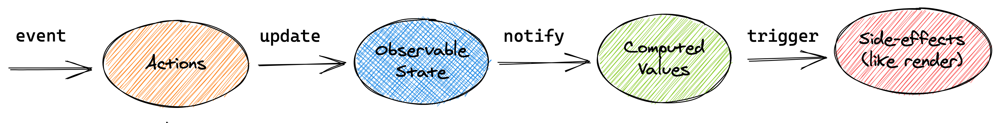

# 状态管理
主要介绍两个状态管理方案：
- Redux
- Mobx6

# Redux
Redux是JavaScript的状态容器，提供可预测化的状态管理

核心状态和工作流程:
**Store**：存储状态的容器，JavaScript对象
**View**: 视图，HTML⻚⾯
**Actions**: 对象，描述对状态进⾏怎样的操作
**Reducers**：函数，操作状态并返回新的状态


## 解决了什么问题
在React中组件通信的数据流是单向的, 顶层组件可以通过props属性向下层组件传递数据, ⽽下层组件不能向上层组件传递数据, 要实现下层组件修改数据, 需要上层组件传递修改数据的⽅法到下层组件. 当项⽬越来越⼤的时候, 组件之间传递数据变得越来越困难.


使⽤Redux管理数据，由于Store独⽴于组件，使得数据管理独⽴于组件，解决了组件与组件之间传递数据困难的问题。


## Redux 工作流程
- 组件通过 dispatch ⽅法触发 Action
- Store 接收 Action 并将 Action 分发给 Reducer
- Reducer 根据 Action 类型对状态进⾏更改并将更改后的状态返回给 Store
- 组件订阅了Store中的状态，Store中的状态更新会同步到组件

## Redux 中间件
### 什么是中间件
中间件允许我们扩展redux应⽤程序。

加入了中间件的工作流程：


### 中间件的开发和使用
中间件模板代码：
```ts
export default store => next => action => {}
```

注册并且使用中间件
```ts
import { createStore, applymiddleware } from 'redux'
import logger from 'middlewares/logger';
createStore(reducer, applyMiddleware(logger));
```

例子：thunk，允许我们在redux的工作流程中加入异步代码,如果action是是function就执行action(),否则就当做正常同步的action来执行。
```ts
const thunk = ({ dispatch, getState }) => next => action => {
  if (typeof action === 'function') {
    return action(dispatch, getState);
  }

  next();
}
```

### 常用的中间件和工具
常用的中间件还有redux saga，主要是用generator来替代async function。
常用的工具：redux-actions,可以简化Action和Reducer的处理,有点类似之前meraki自己写的那些模板，可以一键创建data的模板和各种reducers。

## 手写redux
**createStore**
基本上就是存了state和listeners，更新状态的时候调用`reducer(state, action)`拿到新的state，然后通知调用listeners的callbacks。

**applyMiddleware**
applyMiddleware主要是返回一个新的dispatcher，store的其它的api都不改变。这个新的dispatcher就是chain，调用的时候会一个一个调用middleware，然后最后调用最原始的dispatcher。

**bindActionCreators**
这个有个小技巧，具体看代码注释
```ts
function createStore (reducer, preloadedState, enhancer) {
  if (typeof reducer !== 'function') throw new Error('redcuer必须是函数');
  if (typeof enhancer !== 'undefined') {
    if (typeof enhancer !== 'function') {
      throw new Error('enhancer必须是函数')
    }

    return enhancer(createStore)(reducer, preloadedState);
  }

  let state = preloadedState;     // 状态
  let listeners = [];             // 订阅者
  
  const getState = () => state;

  const subscribe = listener => listeners.push(listener);

  const dispatch = (action) => {
    if (!isPlainObject(action)) throw new Error('action必须是一个对象');
    if (typeof action.type === 'undefined') throw new Error('action对象中必须有type属性');

    state = reducer(state, action);

    listeners.forEach(cb => cb());
  }

  // 默认调用一次dispatch方法 存储初始状态(通过reducer函数传递的默认状态)
  dispatch({ type: 'initAction' })

  return {
    getState,
    dispatch,
    subscribe,
  }
};

// 判断参数是否是对象类型
// 判断对象的当前原型对象是否和顶层原型对象相同
// redux源码里面就这样写的
function isPlainObject (obj) {
  if (typeof obj !== 'object' || obj === null) return false;

  // 区分数组和对象
  var proto = obj;
  while (Object.getPrototypeOf(proto) != null) {
    proto = Object.getPrototypeOf(proto)
  }

  return Object.getPrototypeOf(obj) === proto;
}

function applyMiddleware (...middlewares) {
  return function (createStore) {
    return function (reducer, preloadedState) {
      // 创建 store
      const store = createStore(reducer, preloadedState);

      // 阉割版的 store
      const middlewareAPI = {
        getState: store.getState,
        dispatch: store.dispatch
      }

      // 调用中间件的第一层函数 传递阉割版的store对象
      // chian里面现在存了middleware的下面两层函数
      const chain = middlewares.map(middleware => middleware(middlewareAPI));
      const dispatch = compose(...chain)(store.dispatch);

      return {
        ...store,
        dispatch
      }
    }
  }
}

function compose(...chain) {
  // var chain = [...arguments];   // 伪数组转换成真数组

  /* ----------
    假设调用的时候是applyMiddleware(x, y, z):
    这里反着循环，最后一个middleware(z)的next参数就是reducerDispatch,真正的对于reducer的dispatch
    倒数第二个middleware(y)的next参数就是z
    ......
    最后返回第一个middleware(x)的dispatch，实际上是x最里层的函数action => { doSth(); next(action)) }
    调用的时候就会一直next(action)下去，middleware执行完以后，最后一个next(action)实际上就是reducerDispatch(action)
                                                                                       ---------- */
  return reducerDispatch => {
    let dispatch = reducerDispatch;
    for (let i = chain.length - 1; i >= 0; i--) {
      dispatch = chain[i](dispatch);
    }

    return dispatch;
  }
}

function bindActionCreators (actionCreators, dispatch) {
  var boundActionCreators = {};
  for (var key in actionCreators) {
    // 这里如果不用IIFE的话，actionCreators[key]的key永远会是指向循环最后的key
    // 用IIFE可以让每次的key不要释放，每个actionCreators[key]就会指向正确的key
    // 不确定这个是不是叫闭包，原理就是没有IIFE的时候，() => dispatch(actionCreators[key]()) 这个函数在创建的时候是没有调用key的，在函数执行的时候才调用key，这个时候key就会指向最后一个key。但是IIFE的话就每次都调用了key，等于缓存的当时那个snapshot的key值
    (function (key) {
      boundActionCreators[key] = function () {
        dispatch(actionCreators[key]())
      }
    })(key)
  }
  return boundActionCreators;
}

function combineReducers (reducers) {
  // 1. 检查reducer类型 它必须是函数
  const reducerKeys = Object.keys(reducers);

  reducerKeys.forEach(key => {
    if (typeof reducers[key] !== 'function') throw new Error('reducer必须是函数');
  })

  // 2. 调用每一个小的reducer 将每一个小的reducer中返回的状态存储在一个新的大的对象中
  return function (state, action) {
    const newState = {};
    reducerKeys.forEach(key => {
      const reducer = reducers[key];
      const prevPartialState = state[key];
      const newPartialState = reducer(prevPartialState, action);

      newState[key] = newPartialState
    });
    return newState;
  }
}
```

# MobX 6
## 概述
MobX 是一个简单的可扩展的状态管理库，无样板代码风格简约。

目前最新版本为 6，版本 4 和版本 5 已不再支持。

在 MobX 6 中不推荐使用装饰器语法，因为它不是 ES 标准，并且标准化过程要花费很长时间，但是通过配置仍然可以启用装饰器语法。

MobX 可以运行在任何支持 ES5 的环境中，包含浏览器和 Node。

[MobX](https://mobx.js.org/README.html) 通常和 React 配合使用，但是在 [Angular](https://github.com/mobxjs/mobx-angular) 和 [Vue](https://github.com/mobxjs/mobx-vue) 中也可以使用 MobX。

### 2. 核心概念
- **observable**：被 MobX 跟踪的状态。
- **action**：允许修改状态的方法，在严格模式下只有 action 方法被允许修改状态。
- **computed**：根据现有状态衍生出来的状态。
- **flow**：执行副作用，它是 generator 函数。可以更改状态值。

### 3. 工作流程



### 例子：计数器
在组件中显示数值状态，单击[+1]按钮使数值加一，单击[-1]按钮使数值减一。

#### store
- 通过 observable 标识状态，使状态可观察
- 通过 action 标识修改状态的方法，状态只有通过 action 方法修改后才会通知视图更新

```ts
import { action, makeObservable, observable } from "mobx"

export default class CounterStore {
  constructor() {
    this.count = 0
    makeObservable(this, {
      count: observable,
      increment: action,
      decrement: action
    })
  }
  increment() {
    this.count += 1
  }
  decrement() {
    this.count -= 1
  }
}
```

#### 导入store
创建 Store 类的实例对象并将实例对象传递给组件

```ts
// App.js
import Counter from "./Counter"
import CounterStore from "../store/Counter"

const counterStore = new CounterStore()

function App() {
  return <Counter counterStore={counterStore} />
}

export default App
```

#### 跟store交互
在组件中通过 Store 实例对象获取状态以及操作状态的方法

   ```ts
   function Counter({ counterStore }) {
     return (
       <Container>
         <Button onClick={() => counterStore.increment()}>
           INCREMENT
         </Button>
         <Button>{counterStore.count}</Button>
         <Button onClick={() => counterStore.decrement()}>
           DECREMENT
         </Button>
       </Container>
     )
   }
   
   export default Counter
   ```

#### 数据绑定
当组件中使用到的 MobX 管理的状态发生变化后，使视图更新。通过 observer 方法包裹组件实现目的

```ts
import { observer } from "mobx-react-lite"

function Counter() { }

export default observer(Counter)
```

#### 简化组件代码
```ts
function Counter({ counterStore }) {
  const { count, increment, decrement } = counterStore
  return (
    <Container>
      <Button border="left" onClick={increment}>
        INCREMENT
      </Button>
      <Button>{count}</Button>
      <Button border="right" onClick={decrement}>
        DECREMENT
      </Button>
    </Container>
  )
}
```

当代码如上简化（解构 store）后，修改状态的方法中的 this 指向出现了问题，通过 action.bound 强制绑定 this，使 this 指向 Store 实例对象

```ts
import { action, makeObservable, observable } from "mobx"

export default class CounterStore {
  constructor() {
    this.count = 0
    makeObservable(this, {
      count: observable,
      increment: action.bound,
      decrement: action.bound
    })
  }
  increment() {
    this.count += 1
  }
  decrement() {
    this.count -= 1
  }
}
```

总结：状态变化更新视图的必要条件
1. 状态必须被标记为 `observable`
2. 更改状态的方法必须被标记为 `action`
3. 组件必须通过 `observer` 方法包裹

#### 创建 RootStore
在应用中可存在多个 Store，多个 Store 最终要通过 RootStore 管理，在每个组件都需要获取到 RootStore。

```ts
// store/index.js
import { createContext, useContext } from "react"
import CounterStore from "./Counter"

class RootStore {
  constructor() {
    this.counterStore = new CounterStore()
  }
}
const rootStore = new RootStore()
const RootStoreContext = createContext()

export const RootStoreProvider = ({ children }) => {
  return (
    <RootStoreContext.Provider value={rootStore}>
      {children}
    </RootStoreContext.Provider>
  )
}

export const useRootStore = () => {
  return useContext(RootStoreContext)
}
```

```ts
// App.js
import { RootStoreProvider } from "../store"
import Counter from "./Counter"

function App() {
  return (
    <RootStoreProvider>
      <Counter />
    </RootStoreProvider>
  )
}

export default App
```

```ts
import { observer } from "mobx-react-lite"
import { useRootStore } from "../store"

function Counter() {
  const { counterStore } = useRootStore()
  const { count, increment, decrement } = counterStore
  return (
    <Container>
      <Button onClick={increment}>
        INCREMENT
      </Button>
      <Button>{count}</Button>
      <Button onClick={decrement}>
        DECREMENT
      </Button>
    </Container>
  )
}

export default observer(Counter)
```