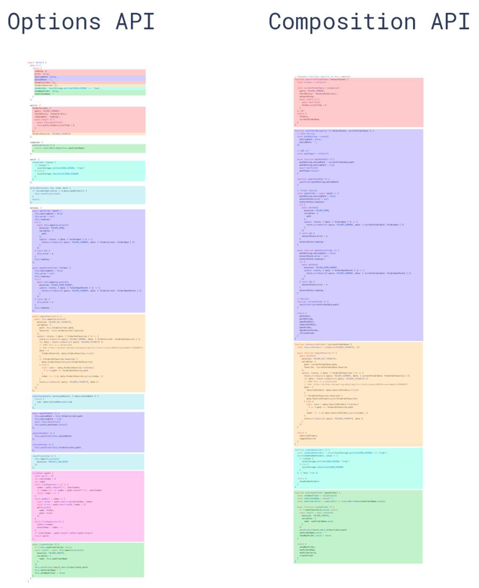
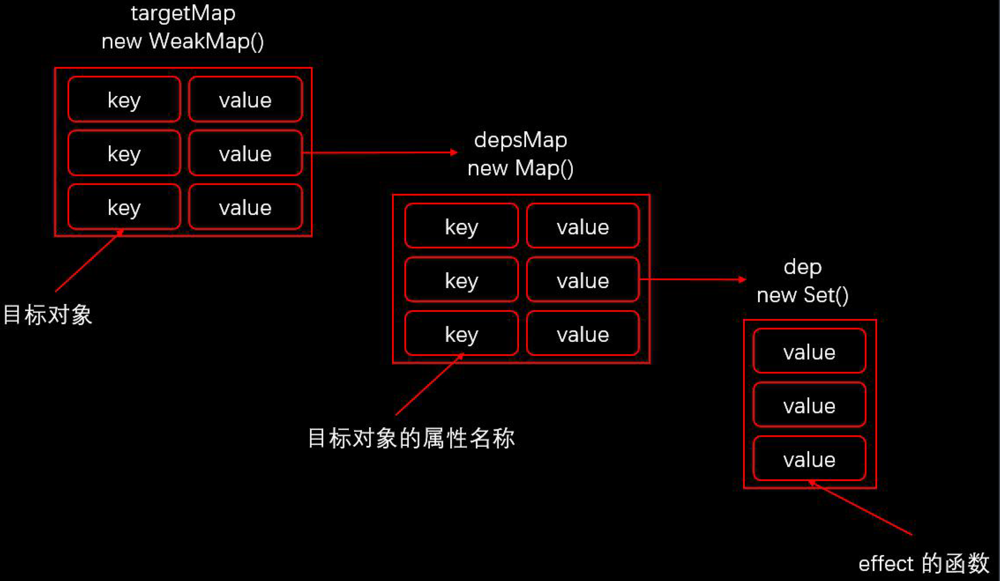

# Vue 3.0
## 与2.0的区别和优势
- 源码改变
  - 用Typescript重写
  - 用monorepo的形式管理项目结构，所以每个module都可以单独拿出来使用。
- composition API
  - 就是vue hook，让同一组逻辑写在一起，提升了可复用性，减少了耦合度。
- 性能提升
  - 响应式系统升级
    - 2.0响应式系统的核心是defineProperty
    - 3.0使用Proxy重写响应式系统
      - Proxy对象实现属性监听
      - 多层属性嵌套，在访问属性的过程中递归处理下一级属性
      - 可以作为单独的模块使用
      - 可以监听动态新增的属性（因为是在get的时候才添加依赖）
      - 可以监听删除的属性
      - 可以监听数组的索引和length属性
  - 编译优化
    - 2.0通过标记静态根节点，优化diff的过程
    - 3.0标记和提升所有的静态根节点，diff的时候只需要对比动态节点内容
  - 源码体积的优化
    - 移除了一些不常用的API
    - Tree-shaking：用vite打包，基于esmodule，所以天生可以treeshaking
- Vite
  - 在开发模式下不需要打包可以直接运行（2.0的Vue-cli开发模式下必须打包才能运行）
  - 快速冷启动，按需编译，模块热更新
  - 生产环境下用Rollup打包（基于ES Module）（Vue-cli使用webpack）

### ES Module
- 现代浏览器都支持ES Module (IE 不支持)
- 加载方式`<script type='module' src='xxx'></script>`
- 默认延迟加载，类似`script`设置了`defer`。在文档解析完成后，触发`DOMContentLoaded`事件之前执行

## Composition API
Vue2.0中的**Options API**：
- 包含一个描述组件选项的(data, methods, props)对象
- 开发复杂组件的时候，同一个功能逻辑的代码被拆分到不同选项，非常耦合，不简洁。

**composition API**是基于函数的API(有点类似useState)，为了把复用的逻辑抽象出来，这样的好处：
- 可复用,更灵活地组织组件的逻辑
- 代码更简洁，直观，易于维护



**使用**：在setup()里面使用。setup()在组件实例创建之前执行，所以无法获取data或者computed属性，也无法通过this获取组件实例。

### 基本例子
一个记录鼠标坐标的例子
```ts
import { createApp, reactive, onMounted, onUnmounted, toRefs } from './node_modules/vue/dist/vue.esm-browser.js'

function useMousePosition () {
  // 这里要手动调用reactive转换成响应式，Vue 3抽象出了这些函数以便更好的座位monorepo和提高函数的复用性。拥抱函数式编程！
  const position = reactive({
    x: 0,
    y: 0
  })

  const update = e => {
    position.x = e.pageX
    position.y = e.pageY
  }

  onMounted(() => window.addEventListener('mousemove', update))
  onUnmounted(() => window.removeEventListener('mousemove', update))

  return toRefs(position)
}

createApp({
  setup () {
    // 这里如果要解构的话就必须要用到toRefs(position), 因为position本身是一个Proxy代理对象，解构完出来的值不是响应式的。
    // 用toRefs会把所有值变成响应式，包括primitive value，比如如果x本身是一个int，会返回一个新的代理对象？（不确定是不是代理对象），这个对象的value就是x
    const { x, y } = useMousePosition()
    return {
      x,
      y
    }
  }
}).mount('app')
```

### 响应式
ref可以将一个普通类型的变量转换成响应式对象。
`x` => `{ value: x, ... }`
```ts
import { createApp, ref } from './node_modules/vue/dist/vue.esm-browser.js'

function useCount () {
  const count = ref(0)
  return {
    count,
    increase: () => {
      count.value++
    }
  }
}

createApp({
  setup () {
    return {
      ...useCount()
    }        
  }
}).mount('#app')
```

### 响应式对象的计算属性
```ts
import { createApp, reactive, computed } from './node_modules/vue/dist/vue.esm-browser.js'

const data = [
  { text: '看书', completed: false },
  { text: '敲代码', completed: true },
]

createApp({
  setup () {
    const todos = reactive(data)

    const activeCount = computed(() => {
      return todos.filter(item => !item.completed).length
    })

    return {
      activeCount,
      push: () => {
        todos.push({
          text: '开会',
          completed: false
        })
      }
    }
  }
}).mount('#app')
```

### 监听响应式数据的变化
可以用到watch或者watchEffect
```ts
import { createApp, ref, watch } from './node_modules/vue/dist/vue.esm-browser.js'

createApp({
  setup () {
    const question = ref('')
    const answer = ref('')

    watch(question, async (newValue, oldValue) => {
      const response = await fetch('https://www.yesno.wtf/api')
      const data = await response.json()
      answer.value = data.answer
    })

    return {
      question,
      answer
    }
  }
}).mount('#app')
```

watchEffect会自动监听回调函数内的变量
```ts
import { createApp, ref, watchEffect } from './node_modules/vue/dist/vue.esm-browser.js'

createApp({
  setup () {
    const count = ref(0)
    const stop = watchEffect(() => {
      console.log("count 变化！")
      console.log(count.value)
    })

    return {
      count,
      stop,
      increase: () => {
        count.value++
      }
    }
  }
}).mount('#app')
```

## 响应式原理实现
我们实现的几个重要Composition API：
- reactive/ref/toRefs
- track/trigger
- effect/computed

#### 数据结构
主要的思路就是把响应式需要触发的每一个事件抽象成一个effect，然后用一个数据结构来存储所有的effect，在get的时候如果这个effect还没有被存储，就存进去。在set的时候，trigger相应的所有effect。

存effect的数据结构:
```ts
// 每一个target就是一个响应式对象，每一个响应式对象的每个key存储了需要触发的所有effect
const targetMap = {                     // 一个Weakmap
  target1: {                            // 每个target对应一个map，存储key => effects
    key1: { effect1, effect2, ... },    // value 是一个set，存储所有effect
    key2: { effect2, effect3, ... }   
  },
  target2: { ... }
  ...
}
```


#### 收集依赖
注意我们在get的时候收集依赖，必须在effect的context下。在执行effect的时候，会把当前的cb赋值给activeEffect，从而被加进targetMap里面。如果不在effect里面执行get,是不会收集依赖的(更准确来讲是收集了一个null依赖，因为activeEffect是null)
```ts
let activeEffect = null
export function effect (callback) {
  activeEffect = callback
  callback()    // 访问响应式对象属性，去收集依赖
  activeEffect = null
}
```

#### 完整源码
```ts
const isObject = val => val !== null && typeof val === 'object'   // typeof null 也是object
const convert = target => isObject(target) ? reactive(target) : target

// 这里不用target.hasOwnProperty主要有两点原因：
// 如果target是Object.create(null)创建出来的对象，就没有原型
// 如果hasOwnProperty被修改过
// 所以用Object.prototype.hasOwnProperty.call是最能确保结果正确的
const hasOwn = (target, key) => Object.prototype.hasOwnProperty.call(target, key)

export function reactive (target) {
  if (!isObject(target)) return target

  const handler = {
    get (target, key, receiver) {
      track(target, key)    // 收集依赖
      const result = Reflect.get(target, key, receiver)

      return convert(result)
    },

    set (target, key, value, receiver) {
      const oldValue = Reflect.get(target, key, receiver)
      let result = true
      if (oldValue !== value) {
        result = Reflect.set(target, key, value, receiver)
        // 触发更新
        trigger(target, key)
      }

      return result
    },

    deleteProperty (target, key) {
      const hadKey = hasOwn(target, key)
      const result = Reflect.deleteProperty(target, key)
      if (hadKey && result) {
        // 触发更新
        trigger(target, key)
      }

      return result
    }
  }

  return new Proxy(target, handler)
}

// 这里其实就等于Watcher的建立过程，Dep.target = this
let activeEffect = null
export function effect (callback) {
  activeEffect = callback
  callback()    // 访问响应式对象属性，去收集依赖
  activeEffect = null
}

let targetMap = new WeakMap()

export function computed (getter) {
  const result = ref()

  effect(() => (result.value = getter()))

  return result
}

// 收集依赖
export function track (target, key) {
  if (!activeEffect) return

  let depsMap = targetMap.get(target)
  if (!depsMap) {
    targetMap.set(target, (depsMap = new Map()))
  }

  let dep = depsMap.get(key)
  if (!dep) {
    depsMap.set(key, (dep = new Set()))
  }

  dep.add(activeEffect)
}

// 触发更新
export function trigger (target, key) {
  const depsMap = targetMap.get(target)
  if (!depsMap) return

  const dep = depsMap.get(key)
  if (dep) {
    dep.forEach(effect => {
      effect()
    })
  }
}

export function ref (raw) {
  // 判断 raw 是否是ref 创建的对象，如果是的话直接返回
  if (isObject(raw) && raw.__v_isRef) { return }

  let value = convert(raw)
  const r = {
    __v_isRef: true,
    get value () {
      track(r, 'value')
      return value
    },

    set value (newValue) {
      if (newValue !== value) {
        raw = newValue
        value = convert(raw)
        trigger(r, 'value')
      }
    }
  }

  return r
}

export function toRefs (proxy) {
  const ret = proxy instanceof Array ? new Array(proxy.length) : {}

  for (const key in proxy) {
    ret[key] = toProxyRef(proxy, key)
  }

  return ret
}

function toProxyRef (proxy, key) {
  const r = {
    __v_isRef: true,
    get value () {
      // 这里不需要收集依赖，因为proxy本身就是响应式对象，所以它内部get()的时候就会收集依赖
      return proxy[key]
    },
    set value (newValue) {
      proxy[key] = newValue
    }
  }
  return r
}
```

### `Reactive` VS `ref`
- ref可以把基本数据类型数据，转换成响应式对象
- ref返回的对象，重新赋值成对象也是响应式的（因为内部value来存值，set的时候还会过一遍reactive, reactive本身的set是只会trigger effect，不会把新的值做响应式处理）
- reactive返回的对象，重新赋值丢失响应式
- reactive返回的对象不可解构

## Vite
用Koa实现一个mini Vite
```ts
#!/usr/bin/env node

const path = require('path')
const { Readable } = require('stream')
const Koa = require('koa')
const send = require('koa-send')
const compilerSFC = require('@vue/compiler-sfc')

const app = new Koa()

const streamToString = stream => new Promise((resolve, reject) => {
  const chunks = []
  stream.on('data', chunk => chunks.push(chunk))
  stream.on('end', () => resolve(Buffer.concat(chunks).toString('utf-8')))
  stream.on('error', reject)
})

const stringToStream = text => {
  const stream = new Readable()
  stream.push(text)
  stream.push(null)
  return stream
}

// 1. 静态文件服务器
app.use(async (ctx, next) => {
  await send(ctx, ctx.path, { root: process.cwd(), index: 'index.html' })
  await next()
})

// 2. 修改第三方模块的路径
app.use(async (ctx, next) => {
  if (ctx.type === 'application/javascript') {
    const contents = await streamToString(ctx.body)
    // import vue from 'vue'
    // import App from './App.vue'
    ctx.body = contents
      .replace(/(from\s+['"])(?![\.\/])/g, '$1/@modules/')
      .replace(/process\.env\.NODE_ENV/g, '"development"')
  }
})

// 3. 加载第三方模块
app.use(async (ctx, next) => {
  // ctx.path --> /@modules/vue
  if (ctx.path.startsWith('/@modules/')) {
    const moduleName = ctx.path.substr(10)
    const pkgPath = path.join(process.cwd(), 'node_modules', moduleName, 'package.json')
    const pkg = require(pkgPath)
    ctx.path = path.join('/node_modules', moduleName, pkg.module)
  }
  await next()
})

// 4. 处理单文件组件
app.use(async (ctx, next) => {
  if (ctx.path.endsWith('.vue')) {
    const contents = await streamToString(ctx.body)
    const { descriptor } = compilerSFC.parse(contents)
    let code
    if (!ctx.query.type) {
      code = descriptor.script.content
      // console.log(code)
      code = code.replace(/export\s+default\s+/g, 'const __script = ')
      code += `
      import { render as __render } from "${ctx.path}?type=template"
      __script.render = __render
      export default __script
      `
    } else if (ctx.query.type === 'template') {
      const templateRender = compilerSFC.compileTemplate({ source: descriptor.template.content })
      code = templateRender.code
    }
    ctx.type = 'application/javascript'
    ctx.body = stringToStream(code)
  }
  await next()
})

app.listen(3000)
console.log('Server running @ http://localhost:3000')
```

## 总结
**vue 3的响应式原理**
- 用一个大的targetMap存储所有的effect，effect就类似于2里面的Watcher的callback
  - targetMap.key存的是这个大的对象
  - targetMap.key.property存的就是这个property的Dep对应的所有effect
  - get的时候，把effect添加到targetMap对应的dep里面。核心函数：track
  - set的时候，找到对应的所有effect，flush。核心函数：trigger
  - delete的时候，跟set的时候一样
- 创建effect的时候，会设一个全局的activeEffect，类似于Dep.target = this。 然后触发effect,effect调用的所有get就会找到activeEffect并且添加到targetMap里面。

**Vue3与Vue2的区别**
- 源码改变
  - 用Typescript重写
  - 用monorepo的形式管理项目结构，所以每个module都可以单独拿出来使用。更倾向于类似函数式编程，跟react有点像。react的scheduler也是可以单独拿出来用的。
- composition API
  - 就是vue hook，让同一组逻辑写在一起，提升了可复用性，减少了耦合度。
- 性能提升
  - 响应式系统升级
    - 2.0响应式系统的核心是defineProperty
    - 3.0使用Proxy重写响应式系统
      - Proxy对象实现属性监听
      - 多层属性嵌套，在访问属性的过程中递归处理下一级属性
      - 可以作为单独的模块使用
      - 可以监听动态新增的属性（因为是在get的时候才添加依赖）
      - 可以监听删除的属性
      - 可以监听数组的索引和length属性
  - 编译优化
    - 2.0通过标记静态根节点，优化diff的过程
    - 3.0标记和提升所有的静态根节点，diff的时候只需要对比动态节点内容
  - 源码体积的优化
    - 移除了一些不常用的API
    - Tree-shaking：用vite打包，基于esmodule，所以天生可以treeshaking
- Vite
  - 在开发模式下不需要打包可以直接运行（2.0的Vue-cli开发模式下必须打包才能运行），可以快速冷启动，按需编译，模块热更新
  - 生产环境下用Rollup打包（基于ES Module，可以静态编译，treeshaking）（Vue-cli使用webpack）